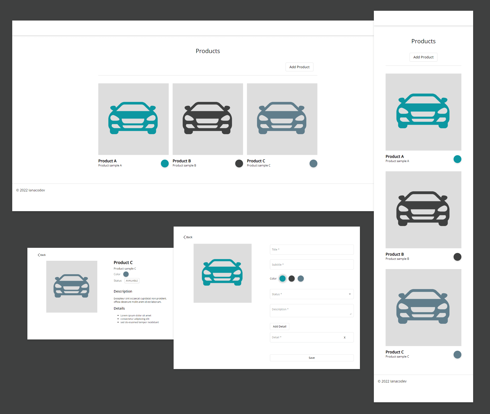

# SampleDemoApp

> ### Sample application to demo different concepts and functionality for angular and ngrx.

<br>
<p>
This app is a generic product website, the user can view the featured product collection, select a product item for detailed view, and add a new product to the collection.
</p>

### Includes

<ul>
  <li>@ngrx/store</li>
  <li>@ngrx/effects</li>
  <li>@ngrx/router-store</li>
  <li>@ngrx/entity</li>
  <li>@ngrx/store-devtools</li>
</ul>
<br>

This project was generated with [Angular CLI](https://github.com/angular/angular-cli) version 13.2.5.

# Overview

### **Design**

<a href="https://xd.adobe.com/view/5061fc71-bf7c-432c-997e-c0c111648317-0532/grid">VIEW DESIGNS (Adobe XD)</a>

### **Live Demo**:

<a href="https://ianacodev.github.io/sample-demo-app" target="_blank">VIEW LIVE DEMO</a>



## Quick start

```
# install dependencies
- npm install

# start application and json server
- npm run start:dev

# Navigate to http://localhost:4200

**Note for live demo purposes http requests to json server have been
commented out and replaced with static data in the products service
to prevent persisting data on demo usage. Uncomment to enable requests.
```

## Development server

Run `ng serve` for a dev server. Navigate to `http://localhost:4200/`. The app will automatically reload if you change any of the source files.

## Code scaffolding

Run `ng generate component component-name` to generate a new component. You can also use `ng generate directive|pipe|service|class|guard|interface|enum|module`.

## Build

Run `ng build` to build the project. The build artifacts will be stored in the `dist/` directory.

## Running unit tests

Run `ng test` to execute the unit tests via [Karma](https://karma-runner.github.io).

## Running end-to-end tests

Run `ng e2e` to execute the end-to-end tests via a platform of your choice. To use this command, you need to first add a package that implements end-to-end testing capabilities.

## Further help

To get more help on the Angular CLI use `ng help` or go check out the [Angular CLI Overview and Command Reference](https://angular.io/cli) page.
